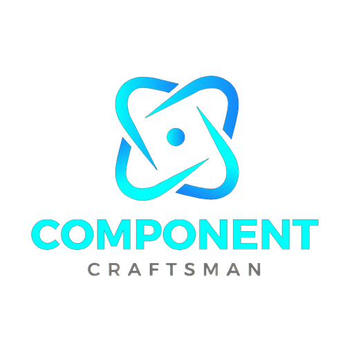

<p align="center">

</p>

## Overview

Component Craftsman is a versatile npm package designed to streamline the development process of React applications by providing a collection of pre-built components, along with built-in input validation and support for custom icons.

### Features

- **Pre-built Components**: Easily integrate common UI components into your React applications, saving development time and effort.
- **Input Validation**: Built-in validation ensures data integrity and user input accuracy, enhancing the overall reliability of your application.
- **Icon Support**: Access a library of custom icons to enhance the visual appeal and functionality of your components.

### Installation

To install Component Craftsman in your project, simply run:

```
npm install component-craftsman
```

Import css:

```
import "component-craftsman/css"
```

### Usage

Once installed, you can import individual components from Component Craftsman into your React application as needed:

```
import { BasicButton} from 'component-craftsman';
```

For detailed usage instructions and documentation, please refer to the [official documentation](https://component-craftsman.vercel.app).

### Features

1. **Responsive Layouts**: Effortlessly create responsive designs with our flexible layout components. From grids and columns to responsive containers, our library provides the building blocks you need to ensure your web applications look great on any device.

2. **Interactive Elements**: Enhance user engagement with our collection of interactive elements, including sliders, tabs, accordions, and tooltips. With intuitive APIs and customizable options, you can easily add dynamic functionality to your React projects without writing complex code from scratch.

3. **Data Visualization**: Visualize your data with ease using our range of charting and graph components. Whether you need to display simple bar charts or intricate scatter plots, our library offers versatile solutions to help you present information in a clear and compelling manner.

4. **Accessibility Features**: Ensure your applications are accessible to all users with our accessible components and icons. We prioritize accessibility best practices, including proper semantic markup and keyboard navigation, to ensure that everyone can interact with your interfaces effectively.

5. **Theming and Customization**: Tailor the look and feel of your applications to match your brand or design preferences with our theming and customization options. From color schemes and typography to icon styles and animations, you have full control over every aspect of your UI design.

6. **Community Support and Updates**: Join a thriving community of developers and designers who contribute to our open-source library and provide support through forums and online resources. Stay up-to-date with the latest trends and updates through regular releases and versioning.

7. **Integration with Popular Libraries**: Seamlessly integrate our components and icons with popular libraries and frameworks, such as Material-UI, Bootstrap, and Tailwind CSS. Whether you're starting a new project or migrating an existing one, our library plays well with others to streamline your development workflow.

8. **Form Validation and Input**: Streamline form handling and validation with our comprehensive set of form components. From input fields and checkboxes to validation messages and error handling, our library simplifies the process of collecting and validating user input, ensuring a seamless user experience.

9. **Animation and Motion**: Add flair to your interfaces with our animation and motion components. From subtle transitions to eye-catching animations, our library offers a variety of effects to delight users and enhance the overall user experience of your React applications.

10. **Internationalization (i18n) Support**: Reach a global audience with our internationalization support, allowing you to easily translate your applications into multiple languages. Our components and icons are designed to support i18n best practices, ensuring that your interfaces are accessible and localized for users around the world.

11. **Cross-Browser Compatibility**: Rest assured that your applications will work seamlessly across all major web browsers, thanks to our commitment to cross-browser compatibility testing and support. Our components and icons are rigorously tested to ensure consistent performance and functionality across different browser environments.

12. **Community Contributions and Extensions**: Extend the functionality of our library with community-contributed components, plugins, and extensions. With a vibrant ecosystem of third-party integrations and add-ons, you can enhance your development workflow and unlock new possibilities for your React projects.

13. **Documentation and Tutorials**: Access comprehensive documentation and tutorials to guide you through the usage and customization of our components and icons. Whether you're a seasoned developer or just getting started with React, our resources provide clear guidance and best practices to help you succeed.

14. **Scalability and Performance**: Build scalable and performant applications with our optimized components and icons. Whether you're working on a small project or a large-scale enterprise application, our library is designed to handle complex UI requirements while maintaining fast load times and smooth performance.

15. **Continuous Improvement**: Benefit from ongoing updates and improvements to our library, as we strive to stay ahead of the curve and incorporate the latest technologies and best practices into our components and icons. Your feedback and suggestions help shape the future direction of our library, ensuring that it remains a valuable resource for the React community.

### Contributing

We welcome contributions from the community! If you'd like to contribute to Component Craftsman, please fork the repository and submit a pull request with your changes. Don't forget to follow our contribution guidelines.

1. Clone the repository:

```
git clone https://github.com/sangamprashant/component-craftsman-site.git
```

2. Install dependencies:

```
cd frontend
npm install
```

3. Start the development server:

```
npm start
```

### License

Component Craftsman is licensed under the [MIT License](LICENSE).
